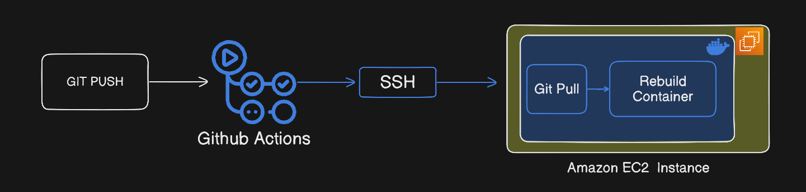

# CI/CD Pipeline for Dockerized Node.js App 🚀

> A production-style CI/CD pipeline that automatically deploys a Dockerized Node.js application to AWS EC2 on every push to the `main` branch using GitHub Actions and SSH.

📌 **Workflow overview:**  


---

## ✨ What this project does

This project demonstrates a **complete end-to-end CI/CD flow** without using managed platforms like Render or Vercel.

On every push to the `main` branch:

1. GitHub Actions is triggered
2. It connects to an AWS EC2 instance via SSH
3. Pulls the latest code
4. Rebuilds the Docker image
5. Restarts the container using Docker Compose
6. The updated app goes live automatically

**In short:**  
`git push → GitHub Actions → EC2 → Docker rebuild → live app`

---

## 🧠 Why this project exists

Managed platforms abstract away a lot of complexity.  
This project was built to **understand what actually happens under the hood**, including:

- Docker image builds
- SSH-based deployments
- AWS networking (Security Groups, ports, Elastic IPs)
- Debugging real CI/CD failures

---

## 🏗 Architecture Overview

```bash Developer (git push)
        ↓
GitHub Actions (CI/CD)
        ↓
 SSH into EC2
        ↓
git pull latest code
        ↓
 docker-compose up --build
        ↓
Updated container live on EC2
```


---

## 🛠 Tech Stack

- **Node.js** (ES Modules)
- **Docker**
- **Docker Compose**
- **GitHub Actions**
- **AWS EC2 (Ubuntu)**
- **SSH (key-based authentication)**

---

## 📂 Project Structure

```bash 
.
├── .github/
│ └── workflows/
│ └── docker-build.yml # CI/CD workflow
├── Dockerfile
├── docker-compose.yml
├── index.js
├── package.json
└── README.md

```

```bash 
# docker-build.yml 


name: Docker CI

on:
  push:
    branches:
      - main

jobs:
  deploy:
    runs-on: ubuntu-latest

    steps:
      - name: Checkout code
        uses: actions/checkout@v4

      - name: Deploy via ssh
        uses: appleboy/ssh-action@v1.0.3
        with:
          host: ${{ secrets.SSH_HOST }}
          username: ubuntu
          key: ${{ secrets.SSH_KEY }}
          script: |
            cd /home/ubuntu/CI_CD_ACTIONS
            git pull origin main
            docker-compose up -d --build

```

---
## 🔐 GitHub Secrets & SSH Setup (Important)

This project uses **SSH-based authentication** to allow GitHub Actions to deploy code to an AWS EC2 instance.

Follow the steps below **carefully** to avoid common mistakes.


### 1️⃣ Add GitHub Actions Secrets

Go to your GitHub repository:


Repository → Settings → Secrets and variables → Actions → New repository secret


Add the following secrets:

#### ✅ SSH_HOST
- **Name:** `SSH_HOST`
- **Value:** Your EC2 **public IP address**  
  (example: `13.xxx.xxx.xxx`)

#### ✅ SSH_KEY
- **Name:** `SSH_KEY`
- **Value:** Your **private SSH key** (generated below)

⚠️ **Do NOT add quotes, extra spaces, or modify the key content.**


### 2️⃣ Generate SSH key pair on your LOCAL system

On your local machine, run:

```bash
ssh-keygen -t rsa -b 4096 -C "ec2@theinstance"
 ```

---
When prompted:

- Enter file path:
Press Enter to accept the default
(./my_private)

- Enter passphrase:
Press Enter (leave it empty)

- Confirm passphrase:
Press Enter

### This will generate two files:

```bash 
this files content will be pasted in SSH_KEY secret

Private key: my_private 
```

```bash 
this files content will be pasted inside ec2 ssh/authorized_keys file

Public key: my_private.pub
```
## ❌ Those 2 key files never meant to be on github repo

## ➡️ Important rules:

Inside authorized_keys if keys already exist, press Enter once to move to a new line

Paste the public key on a single new line

Do NOT delete existing keys

Do NOT add line breaks inside the key

### Save and exit:

- Ctrl + O → Enter to save 

- Ctrl + X

## Fix permissions (VERY IMPORTANT)

On EC2, run:

chmod 700 ~/.ssh
chmod 600 ~/.ssh/authorized_keys

## 🚀 Inside ec2

### Prerequisites
- Docker
- Docker Compose

### Steps

```bash
git clone https://github.com/<your-username>/CI_CD_ACTIONS.git
cd CI_CD_ACTIONS
docker-compose up --build
```
# App will be available at:

http://localhost:8080

## ⚠️ IMPORTANT: Open port 8080 in EC2 Security Group

```bash
This step is critical and easy to miss.

In EC2 → Security Groups → Inbound rules, add:

Type	    Protocol	    Port Range	Source
Custom TCP	TCP	        8080	0.0.0.0/0
```
---
✅ This allows public access to the app

❌ Without this, the app will work inside EC2 but NOT from the browser

App will be accessible at:

http://[EC2_PUBLIC_IP]:8080
---


## 😁 After everything works fine
Then make changes in your code then push it into main branch. After pushing you can go Actions tab on your github repo page to see the magic.

## 👍 I believe you have learnt something from it. Thanks for reading it.
